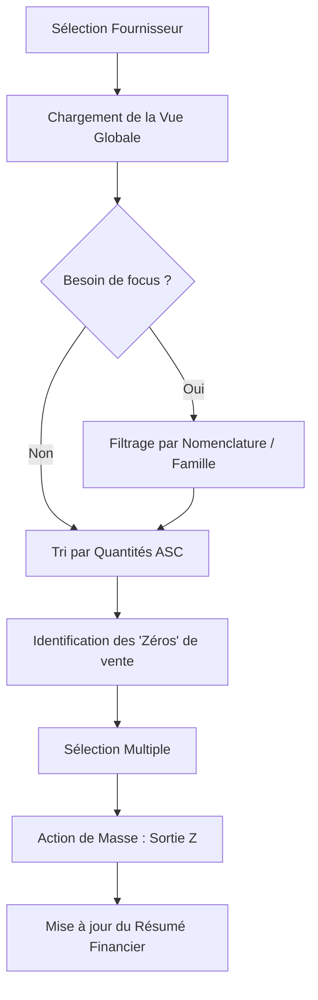
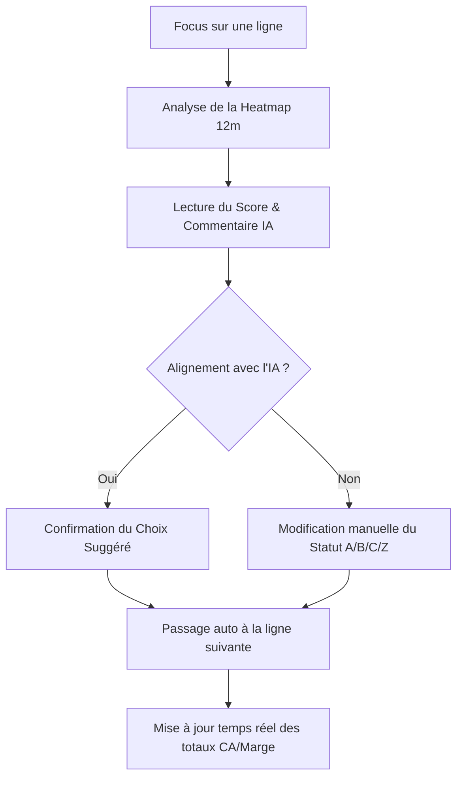
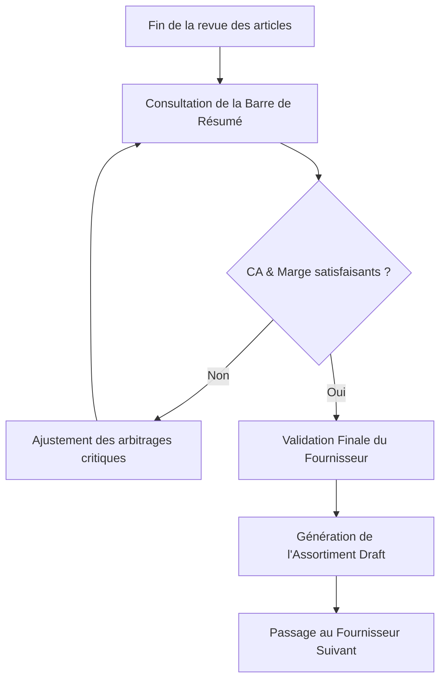

# UX Design Specification CollectFlow

**Author:** Michael
**Date:** 2026-02-20

---

<!-- UX design content will be appended sequentially through collaborative workflow steps -->

## Executive Summary

### Project Vision

L'interface de CollectFlow doit incarner "l'Ergonomie Décisionnelle". Ce n'est pas un outil d'exploration de données complexe, mais une plateforme d'action tactique. L'UX doit masquer la complexité des calculs (jusqu'à 10 000 lignes de données croisées : Ventes, CA, Marge) derrière une interface tabulaire évidente permettant de réviser et valider des assortiments (Gammes A, B, C, Z) en quelques clics.

### Target Users

**L'Acheteur B2B (ou Responsable Réseau) :**
- **Mentalité :** Axé sur le business, le temps est une ressource critique. Privilégie la donnée quantitative pure à l'interprétation graphique abstraite.
- **Fréquence d'usage :** Épisodique (2 à 3 fois par an pour une révision de collection). C'est le point central de notre philosophie UX.
- **Besoins :** Ne veut pas réapprendre l'outil à chaque saison ("Zero-Learning UX"). D'un coup d'œil, il doit pouvoir trier, filtrer et comparer les vrais chiffres pour appliquer son instinct métier (ex: modifier une gamme pour garder un produit de "halo").

### Key Design Challenges

- **Le "Cold Start" (Zero-Learning) :** L'utilisateur doit comprendre intuitivement comment filtrer son périmètre et agir sur la grille dès la première seconde sans documentation.
- **Densité vs Lisibilité (L'enjeu Tabulaire) :** Afficher un tableau de 10 000 lignes avec des historiques de 6 à 12 mois constitués de données chiffrées pures sans provoquer de fatigue visuelle.
- **Le Split-Screen Décisionnel :** Rendre la comparaison analytique entre la *"Gamme Actuelle"* et la *"Gamme Proposée par l'IA"* parfaitement évidente ligne par ligne.

### Design Opportunities

- **Interaction "Inline" Fluide :** Utiliser des menus déroulants directement dans les lignes du tableau pour les modifications de gammes, éliminant les pop-ups ou les pages de détail.
- **Tableau Analytique Haute Performance :** Un tableau robuste présentant les chiffres bruts des ventes mensuelles (Qté), clôturé par des colonnes de Totaux (Total Qté, Total CA, Total Marge sur la période) pour une lecture directe de l'impact financier.
- **Sorting & Filtering Omniprésent :** Chaque colonne cruciale (Nomenclatures, Gammes actuelles/proposées, Totaux Quantités, Marge, CA) doit être interactive, permettant des tris ascendants/descendants et des filtrages instantanés pour isoler immédiatement les top/flops performers.
- **Totalisation Dynamique (Floating Summary Bar) :** Une ligne de totaux (CA, Qté, Marge globaux du périmètre filtré) fixée à l'écran qui se met à jour instantanément lors des modifications de gammes, validant immédiatement l'impact d'une décision.
- **Scoring Colorimétrique Subtil :** Conserver l'affichage en clair des statistiques pour le jugement métier, tout en appliquant un léger fonds de couleur (Heatmap) sur la cellule de marge/CA pour guider l'œil sans masquer la donnée chiffrée.
- **Bulk Actions (Actions en masse) Invisibles mais Accessibles :** Intégrer des fonctions de sélection multiple qui n'encombrent pas l'interface par défaut, mais qui "apparaissent" (Progressive Disclosure) dès qu'un besoin d'action à grande échelle est nécessaire.

## Core User Experience

### Defining Experience

L'action fondamentale de CollectFlow est **la décision d'assortiment ligne à ligne, guidée par un Double Filtre (Algorithme vs IA)**. L'utilisateur scrolle à travers son catalogue et dispose de deux colonnes clés juxtaposées : le **Pre-Score Algorithmique** (la réalité des ventes) et **l'Analyse IA** (la recommandation contextuelle). Si l'IA et l'Algorithme divergent, l'Acheteur arbitre instantanément et corrige la gamme en un clic via un menu déroulant "Inline", sans perdre le contexte.

### Platform Strategy

- **Plateforme Unique :** Application Web (Single Page Application).
- **Cible Matérielle :** Exclusivement Desktop/Laptop (écrans larges 1080p minimum) car la juxtaposition des colonnes de scoring et de texte d'analyse IA nécessite une grande largeur d'affichage. L'usage mobile est hors-périmètre.
- **Interaction :** Essentiellement Souris (scroll, clic sur menus déroulants, tri des en-têtes de colonnes) avec support Clavier pour accélérer. Chrome est le navigateur cible.

### Effortless Interactions

Ce qui doit paraître magique et sans effort :
- **La Comparaison Visuelle "Algo vs IA" :** L'affichage côte à côte d'une colonne "Score Algo" (calculée immédiatement sur le CA, Marge, Qté, Poids et Constance) et d'une colonne "Analyse IA". L'œil détecte immédiatement les anomalies ou les confirmations sans devoir ouvrir un panneau détaillé.
- **L'Édition "Inline" :** Changer un produit de la "Gamme B" à la "Gamme A" doit se faire directement dans la cellule du tableau, sans rechargement de page.
- **Le Recalcul Instantané :** Dès l'instant où une gamme est modifiée, la barre de "Totaux Flottante" (CA, Quantités, Marge) se met à jour en moins de 100ms.

### Critical Success Moments

- **L'Arbitrage Éclair :** Quand l'utilisateur voit qu'un produit considéré comme moyen par l'algorithme est sauvé par une analyse IA pointue (expliquant par exemple une rupture de stock passagère), lui permettant de prendre une décision éclairée en 3 secondes.
- **Le Tri Rapide des "Conflits" :** L'Acheteur peut trier son tableau pour ne voir que les lignes où le Score Algorithmique est "Bon" mais où l'IA propose de "Retirer" le produit, ciblant immédiatement son temps de cerveau disponible sur les vraies questions complexes.
- **La Validation Sans Peur :** La prévisualisation des "Deltas" récapitulant l'impact final avant la sauvegarde.

### Experience Principles

1. **La Machine et l'IA comme Conseillers, l'Acheteur comme Décideur :** L'interface présente les faits (Score Mathématique) et les opinions (Analyse Textuelle IA), mais laisse le contrôle total à l'utilisateur via une interface tabulaire.
2. **Latence Zéro :** Tout filtrage, tri ou modification en session doit être instantané. Le réseau n'est sollicité que pour requêter l'IA ou sauvegarder.
3. **Pardonner l'Erreur :** Les modifications sont conservées en local ("Draft state") jusqu'à la sauvegarde finale globale.

## Desired Emotional Response

### Primary Emotional Goals

**Maitrise et Confiance.** 
L'Acheteur B2B doit se sentir en contrôle absolu. Il ne subit pas l'outil ni l'Intelligence Artificielle ; il les utilise comme des leviers pour amplifier son propre jugement métier. Le système lui donne le sentiment d'être plus rapide, d'avoir un "filet de sécurité" naturel, et une vision "Rayons X" sur sa collection.

### Emotional Journey Mapping

- **À l'ouverture (Cold Start) :** Sentiment de clarté ("Ouf, ce n'est pas une usine à gaz"). Pas d'anxiété face à l'apprentissage ; l'interface tabulaire est familière.
- **Pendant l'utilisation (The Flow) :** Sentiment d'efficacité redoutable. Le tri instantané des 10 000 lignes et l'édition "Inline" créent un rythme de travail hypnotique et fluide.
- **Lors du Nettoyage Algo ("Design de Révélation") :** Soulagement immédiat. En voyant l'interface épurer automatiquement les produits sans ventes sur 12 mois (Auto-Z) et lever des alertes claires sur les ruptures potentielles (0 vente depuis 2-3 mois), l'Acheteur se sent protégé de l'erreur d'inattention ("Le système veille sur moi").
- **Lors de l'Arbitrage Algo vs IA :** Sentiment intellectuellement stimulant ("Je suis l'expert qui tranche les anomalies complexes"). 
- **À la clôture session :** Sentiment de sécurité ("Mon travail est propre et je connais mon impact direct").

### Micro-Emotions

- **Confiance > Anxiété :** Le design tabulaire strict rassure l'esprit cartésien de l'Acheteur.
- **Accomplissement > Frustration :** La barre de totaux qui se met à jour instantanément offre un shoot de dopamine (accomplissement micro-tactique) à chaque validation de gamme.
- **Surprise positive :** La découverte silencieuse de fuites de CA grâce aux alertes visuelles ciblées ("Détective").

### Design Implications

- **Design pour la Confiance :** Les couleurs ("Heatmap") doivent rester subtiles. Les textes des analyses IA doivent être consultatifs (jamais prescriptifs).
- **Design de Révélation :** Utilisation de badges forts pour les épurations évidentes (ex: tag 'Z - Épuration') et d'icônes d'alerte (⚠️ orange) pour les ruptures silencieuses, réduisant radicalement la charge mentale.
- **Design pour l'Accomplissement :** Le feedback visuel lors du changement d'une gamme "Inline" doit être franc et satisfaisant (micro-animation au changement de valeur). L'écran final des "Deltas" doit raconter l'impact financier de la session (CA sauvé, Stock dormant préservé).

### Emotional Design Principles

3. **Le Conseiller, pas le Remplaçant :** L'IA adopte un ton de copilotage objectif, laissant systématiquement la place finale au libre arbitre de l'utilisateur.

## UX Pattern Analysis & Inspiration

### Inspiring Products Analysis

**Apple UI (iOS / macOS / Numbers)**
- **Ce qu'ils font bien :** Le Minimalisme Narratif. Apple ne montre que les contrôles nécessaires à l'instant T (Progressive Disclosure). Les interfaces respirent, même quand il y a beaucoup d'informations.
- **Ce qui rend l'expérience fluide :** La cohérence absolue des composants, les typographies ultra-lisibles (San Francisco), et le feedback visuel immédiat à chaque interaction microscopique.

### Transferable UX Patterns

**1. Design Système Typographique Obessionnel :**
- Utiliser une hiérarchie de textes extrêmement rigoureuse. Les chiffres financiers (CA, Marge) utilisent une police monospace (chiffres alignés verticalement) pour une scannabilité instantanée.

**2. Le "Progressive Disclosure" (Divulgation Progressive) :**
- Masquer les filtres complexes derrière un bouton "Filtres" épuré. Les actions en masse (Bulk actions) n'apparaissent que lorsqu'une ligne ou toutes les lignes sont sélectionnées. 

**3. Le Feedback Visuel (Micro-interactions) :**
- Bien que sur le Web, reproduire la sensation de réactivité d'Apple. Lorsqu'une "Gamme" passe de B à A, la ligne opère une transition douce (fade-in coloré) pour valider l'action à l'œil.

### Anti-Patterns to Avoid

- **L'Esthétisme au détriment de la Densité :** L'Acheteur a besoin de voir un maximum de lignes sur son grand écran. Il faut l'épure d'Apple, mais la densité d'un outil pro (pas d'espaces blancs démesurés).
- **Les Icônes Cryptiques sans labels :** Toujours privilégier Textes clairs + Icônes standards ("Filtrer", "Trier", "Générer IA") pour le "Zero-Learning".

### Design Inspiration Strategy

**What to Adopt (Ce qu'on prend) :**
- La clarté typographique (police type Inter / San Francisco) pour les données.
- La disparition des bordures de tableaux lourdes au profit de séparations gris très clair.
- Les feedbacks de validation subtils et immédiats.

**What to Adapt (Ce qu'on adapte) :**
- La densité d'information. CollectFlow compactera l'UI Apple pour afficher le plus de lignes possibles simultanément sans scroller excessivement.

**What to Avoid (Ce qu'on rejette) :**
- Les animations gadgets ou très longues (>200ms) qui ralentiraient le "Flow" frénétique d'un acheteur validant 500 produits.

## Design System Foundation

### 1.1 Design System Choice

**Headless UI + Utility-First CSS**
Nous opterons pour une architecture front-end composable basée sur **React**, **Tailwind CSS**, et des bibliothèques de composants non-stylés ("Headless") comme **Shadcn UI** ou **Radix UI**, couplées à un moteur de tableau haute performance (**TanStack Table** avec virtualisation).

### Rationale for Selection

- **Vitesse & Indépendance Visuelle :** Tailwind CSS permet de coder rapidement une interface au pixel près, reproduisant l'élégance "façon Apple" (San Francisco/Inter, gris subtils, absence de bordures lourdes), sans subir l'esthétique générique "Google Material" d'un système comme MUI.
- **Densité Contrôlée :** Dans un workflow B2B où chaque pixel compte, une approche "Headless" nous donne un contrôle absolu de la marge et du padding, essentiel pour densifier notre tableau de 10 000 lignes tout en conservant une grande lisibilité.
- **Performance Tabulaire Critique :** L'interface repose presque exclusivement sur les manipulations de très larges volumes de données côté client. TanStack Table garantit des tris, filtres et rendus sans latence ("Zero-Latency Flow").

### Implementation Approach

- Installation d'une base React/Vite.
- Configuration stricte du thème Tailwind pour adhérer aux contraintes typographiques et colorimétriques définies (Heatmap légère pour les scores, pas de composants intempestifs).
- Mise en place d'un composant Tableau virtuel (React-Window ou équivalent) dès la fondation pour absorber la charge de données du schéma SQL sans pénaliser le navigateur.

### Customization Strategy

- **Typographie :** Utiliser des polices à haute lisibilité pour les données et une police Monospace stricte pour les données financières afin de garantir l'alignement vertical des décimales.
- **Micro-Interactions :** Standardiser une durée de transition de 100ms maximum pour les feedbacks visuels (clics, changements de gammes 'Inline') pour renforcer l'aspect dynamique et l'impact immédiat des décisions, sans jamais ralentir l'Acheteur.

## 2. Core User Experience

### 2.1 Defining Experience

**L'Arbitrage Augmenté ("The Augmented Trade-off")**
L'action fondatrice de CollectFlow est le moment où l'Acheteur regarde une ligne de produit, constate visuellement une divergence entre son intuition métier, le "Pre-Score Algorithmique" (mathématique), et la "Recommandation IA" (contextuelle). Il tranche ce désaccord en modifiant la gamme (ex: Z -> B) via un menu déroulant "Inline", et valide instantanément l'impact de son choix grâce à la mise à jour en temps réel de la barre de Totaux. 

### 2.2 User Mental Model

- **Modèle Actuel :** L'Acheteur a l'habitude d'extraire des données brutes vers Excel, d'utiliser des recherches en V croisées (VLOOKUP) avec son budget, de colorier des lignes à la main et de saisir de nouvelles valeurs sans vision globale immédiate de son impact financier total.
- **Le Nouveau Paradigme :** Un tableau de bord intelligent qui a déjà mâché le travail d'extraction et de calcul (le "Pre-Score" et l'"Auto-Z" réduisent 80% du bruit). L'attente centrale est une fluidité absolue : l'Acheteur ne "navigue" pas entre des pages de détails de produits, il "pilote" une liste géante.

### 2.3 Success Criteria

1. **Confiance Visuelle (Zero ambiguity) :** Au survol (Hover), la ligne entière doit être surlignée distinctement pour éviter toute erreur de saisie sur un tableau dense de 10 000 lignes.
2. **Vitesse Pure (Action "Headless") :** L'ouverture du menu déroulant et la sélection d'une nouvelle gamme (A, B, C, Z) doivent s'effectuer sans le moindre lag de réseau.
3. **Récompense Immédiate (The Dosage of Dopamine) :** L'impact de la décision est validé par l'animation instantanée (≤ 100ms) de la barre de "Totaux Flottante" (CA, Quantités, Marge), prouvant à l'Acheteur qu'il vient de créer de la valeur.

### 2.4 Novel UX Patterns

Le format de base (Dashboard Tabulaire) est délibérément **très classique** pour minimiser la courbe d'apprentissage.
La "Nouveauté" réside dans :
- **La Juxtaposition Cognitive :** Mettre côte-à-côte, sur la même ligne, le calcul purement arithmétique (le Score) et l'inférence contextuelle textuelle (l'IA), forçant l'humain à jouer le rôle d'arbitre final.
- **La Bar de Totaux Hautement Réactive :** Un composant qui donne l'illusion de reculyler 10 000 lignes croisées à la volée dans un navigateur web, offrant une expérience "Logiciel de Bureau" (façon Apple Numbers) plutôt que "Page Web Classique".

### 2.5 Experience Mechanics

1. **Initiation :** Pendant le défilement (Scroll) de sa liste filtrée, l'œil de l'Acheteur est attiré par une alerte visuelle (tag ⚠️ orange de rupture de stock) ou un contraste entre un Score élevé et une recommandation IA "Retirer".
2. **Interaction :** L'utilisateur clique sur la cellule `Gamme` de la ligne concernée. Le menu déroulant s'ouvre, il choisit sa nouvelle sélection.
3. **Feedback :** La cellule affiche la nouvelle valeur soutenue par une légère transition de fond coloré (ex: vert clair pour `A`, rouge léger pour `Z`). De manière synchrone, les chiffres de la "Barre de Résumé Flottante" pulsent ou défilent vers leurs nouvelles valeurs.
4. **Completion :** L'action est terminée, enregistrée en local (Draft state). L'Acheteur passe avec fluidité à la ligne critique suivante, sans aucune action de confirmation requise pour cette modification unitaire.

## Visual Design Foundation

### Color System (Dual Theme)

Le système colorimétrique sera 100% sémantique et binaire (Light/Dark).

**1. Les Neutres (L'interface silencieuse) :**
- **Mode Clair :** Fond `White`, bordures `Gray-200`, texte principal `Slate-900`.
- **Mode Sombre :** Fond `Slate-950` (un gris-bleu très profond, pas de noir pur `#000` qui fatigue la rétine), bordures `Slate-800`, texte `Slate-200`.

**2. Les Sémantiques (La "Heatmap") :**
- Les couleurs ne servent *qu'à porter une information* (Jamais de décoration). 
- **Succès / A / Bon Score Algo :** Vert émeraude désaturé en mode clair (`Emerald-50` fond / `Emerald-700` texte), et `Emerald-950` fond / `Emerald-400` texte en Mode Sombre.
- **Alerte / Z / Rupture :** Rouge-Orange (`Rose-50` / `Rose-900`).
- Ces couleurs sont appliquées en "Heatmap" (fond de cellule très léger) limitées aux colonnes Pre-Score et IA.

### Typography System

- **Données textuelles & UI :** `Inter` ou `San Francisco` (system-ui). Une typographie sans-serif, neutre, extrêmement lisible même en corps 12px.
- **Données financières (CA, Marge, Quantités) :** Utilisation stricte de la propriété CSS `font-variant-numeric: tabular-nums` (ou déclinaison Monospace type `JetBrains Mono`). C'est **critique** : 1000.00 et 999.00 doivent occuper exactement la même largeur en pixels pour une scannabilité verticale parfaite.

### Spacing & Layout Foundation

- **Densité Maximale ("Compact-First") :** Le padding sera réduit au strict minimum (ex: `32px` de hauteur par ligne) pour afficher un maximum de références (jusqu'à 50 lignes simultanément) sur un écran 1080p.
- **Grid de Lecture :** Retrait des bordures verticales dans le tableau. Seules de fines bordures horizontales (très claires) guideront l'œil, dans la plus pure tradition des grands logiciels d'analyse.

### Accessibility Considerations

- Le contraste entre le texte des données et le fond (même coloré par la Heatmap) devra toujours respecter la norme WCAG AA.
- Support natif du basculement instantané (Toggle) entre Mode Clair et Sombre, sans rechargement.
- Utilisation des touches fléchées du clavier (Haut/Bas) pour naviguer de ligne en ligne afin de limiter l'usage de la souris lors des longues sessions partielles.

## Design Direction Decision

### Design Directions Explored

Multiple directions were explored through an interactive HTML showcase, ranging from a "Split-Screen Analyst" approach (AI in a panel) to a "Dense Spreadsheet" and an "Extended Focus" layout. The exploration focused on balancing high data density (M1-M12 sales history) with professional tool ergonomics for 32" monitors.

### Chosen Direction

**Direction 1: The Extended Focus (Ultra-Dense)**
- **Fluid Layout**: Adapts to 100% width of large monitors (32").
- **Integrated Columns**: Nomenclature, M1-M12 history, Total 12m Quantity, and double-line Margin (€/%) are all visible in a single row.
- **Visual Hierarchy**: Centered alignment for financial data (CA, Margin) to provide breathing room between data blocks.
- **Detailed Historial View**: Explicit labels for Month/Year (e.g., "Jan 25") on the sliding 12-month window.
- **Production-Ready Formatting**: Full numerical values instead of shortened 'k' abbreviations for absolute precision in arbitrage.

### Design Rationale

This direction was chosen because it allows the Buyer to perform line-by-line arbitrage without horizontal scrolling or context switching. On a 32-inch screen, the fluid layout utilizes the full resolution to present a "panoramic" view of each product's performance. The inclusion of Nomenclature inline is critical for the initial global screening phase of the assortment process.

### Implementation Approach

The interface will be built using a robust Grid System (Tailwind CSS / Radix UI) to ensure responsive fluidity. Typography will prioritize efficiency with 'Inter' for UI and 'JetBrains Mono' for tabular data. Categorization actions (A, B, C, Z) will be handled via high-contrast select menus to ensure rapid tactile confirmation.

## User Journey Flows

### 1. Épuration & Filtrage Massif
Ce parcours permet à l'acheteur de rapidement éliminer les références sans vente ou les doublons pour réduire la charge cognitive avant l'analyse fine.

### 2. Arbitrage Fin (Ligne à Ligne)
C'est le cœur de l'application. L'acheteur utilise les indices visuels (Heatmap) et l'IA pour statuer sur chaque produit.

### 3. Validation & Bouclage
L'acheteur vérifie l'impact macro-économique de ses choix individuels avant de sceller l'assortiment pour le fournisseur.

### Journey Patterns

- **Pattern de Confirmation Implicite** : Le passage automatique à la ligne suivante après un arbitrage accélère considérablement le flux de travail.
- **Pattern de Feedback Financier** : Mise à jour instantanée des indicateurs globaux (CA/Marge) dans la barre flottante à chaque modification de statut (A/B/C/Z).
- **Pattern de Filtrage Progressif** : Utilisation de la Nomenclature pour passer d'une vue de survol à une vue spécialisée sans perdre le contexte financier global.

### Flow Optimization Principles

- **Minimisation du Scroll** : Utilisation de la grille fluide "Ultra-Dense" pour garder toutes les données décisionnelles dans le viewport.
- **Réduction de la Charge Cognitive** : Mise en évidence visuelle (Heatmap/Couleurs) des anomalies de vente pour attirer l'œil de l'acheteur là où son intervention est requise.
- **Feedback Immédiat** : Chaque interaction produit un résultat visible (changement de couleur de ligne, mise à jour des totaux).

## Component Strategy

### Design System Components

L'application s'appuiera sur **Tailwind CSS / Radix UI** pour les composants d'infrastructure.

- **Layout & Structure** : Sidebar, TopNav, Container Fluide.
- **Gestion des États** : Modal (Dialog), Dropdown Menu, Tooltip.
- **Formulaires** : Input text (Search), Button (Primary/Secondary), Checkbox (Multi-sélection).

### Custom Components

Ces blocs sont conçus sur mesure pour répondre aux besoins de densité et d'analyse métier de CollectFlow.

#### Heatmap Sales Grid
**Purpose:** Offrir une lecture instantanée de la saisonnalité et des ruptures de stock sur 12 mois glissants.
- **Anatomy**: Grille de 12 colonnes avec coloration conditionnelle (Bleu = Ventes, Orange = Alerte chute, Gris = Zéro). 
- **Accessibility**: Tooltips détaillant les quantités exactes et le mois/année au survol de chaque cellule.

#### Financial Cell
**Purpose:** Présenter les indicateurs de performance financière (CA et Marge) de manière équilibrée.
- **Anatomy**: Cellule double ligne.
- **Variants**: Affichage du pourcentage de marge avec un badge de couleur (Vert > 40%, Orange 20-40%, Rouge < 20%).

#### AI Insights Block
**Purpose:** Synthétiser le raisonnement de l'algorithme pour justifier le score suggéré.
- **Interaction**: Texte court affiché directement, avec possibilité d'expansion pour les analyses complexes.

#### Arbitrage Select
**Purpose:** Permettre un changement de statut (A/B/C/Z) rapide et tactile.
- **States**: Bordure colorée spécifique à chaque statut (Cœur = Indigo, Sortie = Rose/Rouge).

#### Floating Summary Bar
**Purpose:** Garder l'acheteur informé de l'impact macro de ses micro-décisions.
- **Anatomy**: Barre fixe en bas d'écran calculant dynamiquement les totaux (Volume total, CA cumulé, Marge moyenne).

### Component Implementation Strategy

- Tous les composants custom seront stylisés via les **Tokens de Design** définis à l'étape 6.
- Utilisation de la police `JetBrains Mono` pour toutes les données tabulaires afin de garantir un alignement vertical parfait des chiffres.
- Support natif du **Mode Sombre** pour chaque composant.

### Implementation Roadmap

- **Phase 1 - Fondations** : Grille de données fluide et Layout global.
- **Phase 2 - Composants de Lecture** : Heatmap 12m, Cellules financières, Blocs IA.
- **Phase 3 - Composants d'Action** : Sélecteur d'arbitrage et Barre de résumé dynamique.

## UX Consistency Patterns

### Button Hierarchy

- **Action Primaire (Brand 600)** : Boutons "Valider le Fournisseur", "Confirmer l'Assortiment". Utilisés pour clore un cycle de décision. Un seul par vue principale.
- **Action Secondaire (Slate 700 / Outline)** : Boutons "Export Excel", "Détails Produit". Pour les actions non critiques.
- **Action de Danger (Rose 600)** : Boutons "Vider la sélection", "Réinitialiser". Utilisés avec une confirmation de sécurité.

### Feedback Patterns

- **Indicateurs de Performance (Marge)** :
    - **Vert (Émeraude)** : Marge > 45%. Succès.
    - **Orange (Amber)** : Marge entre 20% et 40%. Attention.
    - **Rouge (Rose)** : Marge < 20%. Critique, nécessite une action Z ou renégociation.
- **Anomalies de Vente (Heatmap)** :
    - Bordure Orange sur une cellule si la variation mensuelle est négative de plus de 50%.
- **Notifications IA** :
    - Utilisation des icônes : 🤖 (Optimisation), ⚠️ (Risque), ✅ (Opportunité).

### Navigation Patterns

- **Auto-Jump Logic** : Lors d'un arbitrage manuel (A, B, C ou Z), l'application déplace automatiquement le focus visuel sur la référence suivante du tableau.
- **Sticky Headers** : Les colonnes d'en-tête et le résumé financier bas restent fixes pendant le défilement pour garantir que les totaux et les labels sont toujours visibles.

### Additional Patterns

- **Empty States** : En l'absence de données pour un fournisseur, affichage d'une vue illustrée incitant à vérifier la période de synchronisation ERP ou à changer de fournisseur.
- **Loading Pattern** : Utilisation de Skeletons (formes grises animées) respectant la structure de la grille "Ultra-Dense" pour éviter les sauts de mise en page pendant le chargement des données.

## Responsive Design & Accessibility

### Responsive Strategy

L'application adopte une approche **Desktop-First / Data-Centric**, privilégiant l'efficacité de l'analyse sur grand écran tout en maintenant une accessibilité critique sur les autres supports.

- **Desktop (32" et +)** : Affichage intégral de la grille fluide. Espace utilisé pour maximiser la visibilité des préconisations IA et des séries temporelles.
- **Laptop (13-15")** : Mode compact avec réduction des marges et masquage des colonnes de contexte non essentielles.
- **Tablette / Mobile** : Vue de consultation focalisée sur les totaux de CA/Marge et la capacité de valider un arbitrage simple déjà préparé.

### Breakpoint Strategy

- **Large Desktop (XL)** : > 1440px (Optimisé pour 32").
- **Desktop (LG)** : 1024px - 1439px.
- **Tablet (MD)** : 768px - 1023px.
- **Mobile (SM)** : < 767px.

### Accessibility Strategy (WCAG AA)

- **Contraste** : Ratio minimum de 4.5:1, même au sein de la Heatmap.
- **Typographie** : `font-variant-numeric: tabular-nums` pour un alignement décimal parfait des monnaies.
- **Focus States** : Indicateurs de focus visuels clairs lors de la navigation au clavier.

### Testing Strategy

- **Performance** : Test de réactivité de la grille jusqu'à 10 000 entrées.
- **Compatibilité** : Validation croisée sur les moteurs Blink (Chrome/Edge) et Webkit (Safari).
- **Accessibilité** : Audit automatisé (Axe/Lighthouse) complété par un test manuel de navigation au clavier.

### Implementation Guidelines

- Utilisation de `CSS Grid` et `Flexbox` pour la fluidité.
- Isolation des composants métier pour garantir que le moteur de calcul financier (Summary Bar) reste performant même en cas de scroll intensif.
- Respect strict des rôles ARIA pour le sélecteur d'arbitrage A/B/C/Z.

